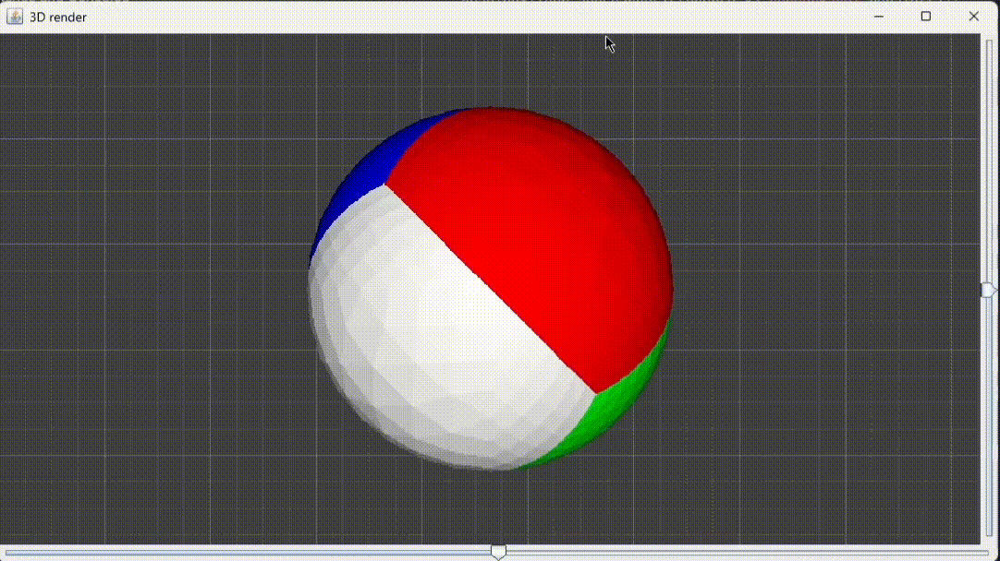

# 🧊 3D Renderer in Java (Software Rendering)


A simple **3D software renderer built from scratch in Java using Swing**.

This project demonstrates how a basic **3D graphics pipeline** works without using OpenGL or external libraries.  
Triangles are transformed, projected, rasterized, and depth-tested entirely on the CPU.

The renderer displays a **subdivided 3D polyhedron** that can be rotated, panned, and zoomed interactively.

---

# Demo



---

# ✨ Features

- 🔺 Triangle mesh rendering
- 🔄 Real-time object rotation
- 📐 Matrix-based 3D transformations
- 🎨 Surface shading using triangle normals
- 🧠 Z-buffer depth testing
- 🖼 Triangle rasterization using barycentric coordinates
- 🔍 Mouse zoom and panning
- 🎛 Rotation controls using sliders
- 📉 Subdivision-based mesh inflation

---

# 🎮 Controls

| Input | Action |
|------|------|
| **Horizontal Slider** | Rotate object around Y axis |
| **Vertical Slider** | Rotate object around X axis |
| **Left Mouse Drag** | Rotate object |
| **Middle Mouse Drag** | Pan scene |
| **Mouse Wheel** | Zoom in / out |

---

# 🧠 How It Works

## 1️⃣ Triangle Mesh

The renderer starts with a tetrahedron made from 4 triangles.

```

Triangle(v1, v2, v3)

```

Each triangle stores:

- three 3D vertices
- a surface color

---

## 2️⃣ Mesh Subdivision

Triangles are recursively subdivided using the `inflate()` function.

Each triangle becomes four smaller triangles:

```

```
    v1
   /\
  /__\
 /\  /\
/__\/__\
```

```

After subdivision, vertices are normalized to form a **rounded shape similar to a sphere**.

This creates a smooth mesh for rendering.

---

## 3️⃣ 3D Transformations

Object rotation is handled using **3×3 rotation matrices**.

Example rotation matrix:

```

| cosθ  0  -sinθ |
| 0     1   0    |
| sinθ  0   cosθ |

```

These matrices transform each vertex in 3D space.

---

## 4️⃣ Projection to Screen

After transformation, vertices are mapped to screen space:

```

3D vertex → screen position

```

This allows triangles to be rasterized onto a 2D image.

---

## 5️⃣ Triangle Rasterization

Each triangle is rendered pixel-by-pixel using **barycentric coordinates**.

For each pixel inside the triangle:

```

b1 + b2 + b3 = 1

```

The barycentric weights determine whether a pixel lies inside the triangle.

---

## 6️⃣ Z-Buffer Depth Testing

To ensure correct triangle visibility, the renderer uses a **depth buffer**.

For each pixel:

```

if (depth > zBuffer[pixel])
draw pixel

```

This prevents triangles behind others from being drawn.

---

## 7️⃣ Simple Lighting

Lighting is calculated using the triangle's **surface normal**.

```

brightness = |normal.z|

```

This produces basic shading based on the triangle orientation.

---

# 📚 Concepts Demonstrated

This project explores several core graphics programming concepts:

- 3D transformations
- Triangle rasterization
- Barycentric coordinates
- Depth buffering
- Software rendering
- Basic shading
- Mesh subdivision

---

If you want, I can also show you **one small improvement to this renderer** that would make the project **look significantly more advanced**: adding **true perspective projection instead of orthographic projection** (it’s only ~5 lines of math).
